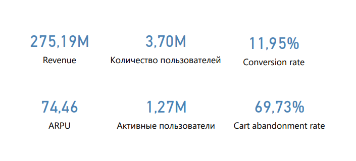
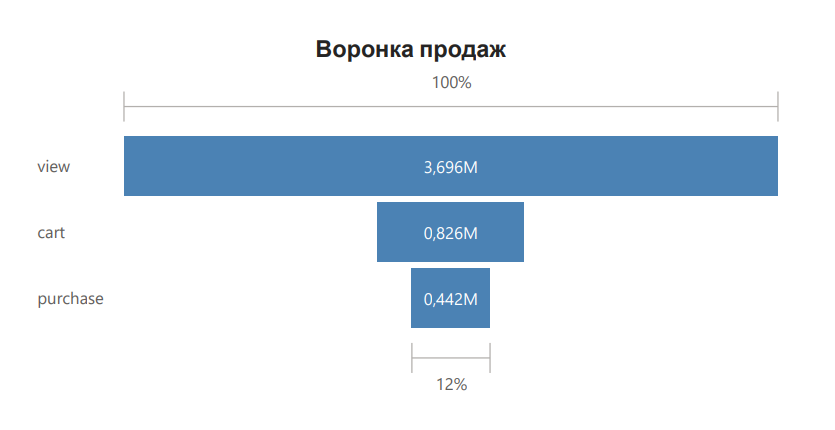
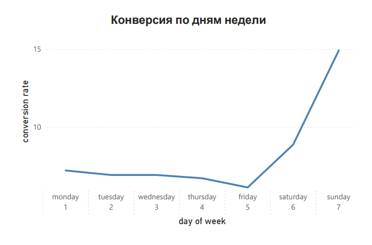
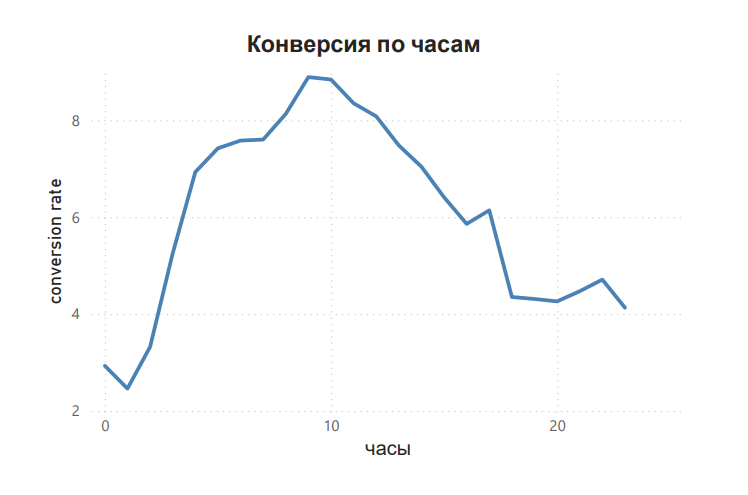
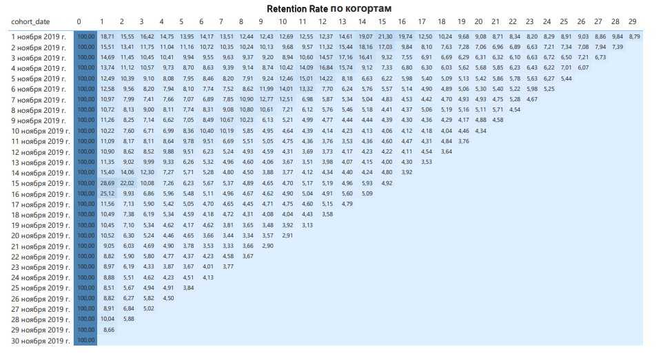
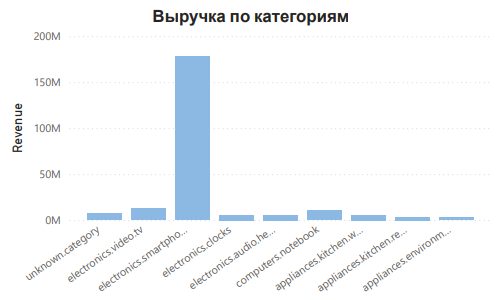

# Анализ поведения пользователей интернет-магазина за ноябрь 2019 года

В этом проекте я провела продуктовый анализ поведения пользователей интернет-магазина с целью выявления точек потери конверсии и возможностей роста выручки.  
**Цель:** выявить узкие места воронки продаж, оценить удержание клиентов и предложить идеи для роста выручки.  
**Данные:** набор eCommerce behavior data from multi category store на Kaggle  
(https://www.kaggle.com/datasets/mkechinov/ecommerce-behavior-data-from-multi-category-store/data)

**Структура данных:**
| Поле | Описание |
|-----------|-----------|
| event_time  | Дата и время действия пользователя за ноябрь 2019  |
| event_type  | Тип события (view, cart, purchase)  |
| product_id  |ID товара|
| category_id / category_code  |Категория товара|
| brand  |Бренд товара|
| price  |Цена товара|
| user_id  |ID пользователя|
| user_session  |ID сессии|

**Этапы работы:**
1. Изучила данные
2. Определила структуру итоговых CSV-файлов
3. Написала необходимые SQL-скрипты
4. Полученные результаты визуализировала в Power BI
5. Проанализировала полученные данные и предложила решения

**Используемые инструменты:** SQL, Power BI

**Итоговый результат:** [Полный  дашборд (PDF)](dashboard.pdf)

**1. Основные метрики:**  

**Вывод:** значение Cart Abandonment Rate высокое  (CAR = 69,7%), следовательно, пользователи часто бросают собранные корзины.  
**Возможные причины:** высокая стоимость доставки или долгая доставка, сложный интерфейс оплаты, необходимость регистрации.  
**Решения:** добавить индикатор бесплатной доставки начиная с определенной суммы, e-mail рассылка о товарах, оставленных в корзине, сохранять корзину между сессиями пользователя.
**2. Воронка:**

**Предложение:** увеличить конверсию на этапе view -> cart  
**Решения:**  
1. Добавить блок "часто задаваемые вопросы" о доставке и возврате
2. Показывать остаток на складе и сроки доставки
3. Добавить видеообзор товара
4. Сделать кнопку "добавить в корзину" более заметной
5. Добавить больше отзывов

**3. Конверсия по часам дня и дням недели:**

  
  

**Вывод:** видны пики конверсии в 9:00 (CR = 8,9%) и в воскресенье (CR = 14,9%)
**Рекомендации:** запуск акций и push-уведомлений в часы и дни с максимальной конверсией

**4. Retention Rate по когортам**

 
**Предложения:** можно будет увидеть, что наиболее продаваемая категория товаров - это смартфоны, для повышения удержания рекомендую больше развивать категории товаров, которые пользователи покупают чаще.  
Также можно внедрить: персональные рекомендации товаров, бонусы за повторную покупку.

**5. Выручка по категориям**

**Вывод:** основная выручка сконцентрирована в одной категории. Следовательно, при падении спроса произойдет падение выручки.  
**Решения:** развивать смежные категории товаров, внедрить продажи товаров комплектом, добавить блок "с этим также покупают" на карточке смартфона (чехлы, защитные стекла, зарядные устройства).

**Итог**  
Выявленные проблемы:  
 1. Потеря пользователей между добавлением в корзину и покупкой (CAR = 69.7%).
 2. Выручка сконцентрирована в категории товаров смартфоны, которую пользователи покупают редко.
 3. Вследствие пункта 2, удержание пользователей быстро падает после первого взаимодействия.

Предложения:
1. Добавить индикатор бесплатной доставки начиная с определенной суммы, e-mail рассылка о товарах, оставленных в корзине, сохранять корзину между сессиями пользователя, проверить скорость работы сайта
2. Добавить больше информации о товаре, сделать кнопку "добавить в корзину" более заметной
3. Запуск акций и push-уведомлений в часы (9:00) и дни (воскресенье) с максимальной конверсией 
4. Развивать смежные категории товаров (аксессуары, часы, наушники), внедрить продажи товаров комплектом.

В ходе проекта я:  
 • применила SQL к прикладной задаче  
 • освоила программу Power BI  
 • интерпретировала полученные результаты и выдвинула гипотезы для улучшения продукта 
